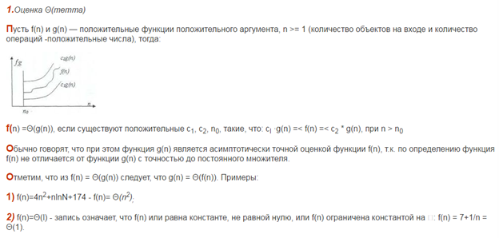
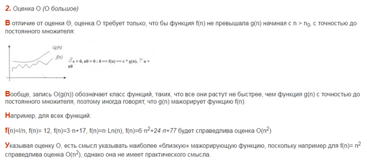
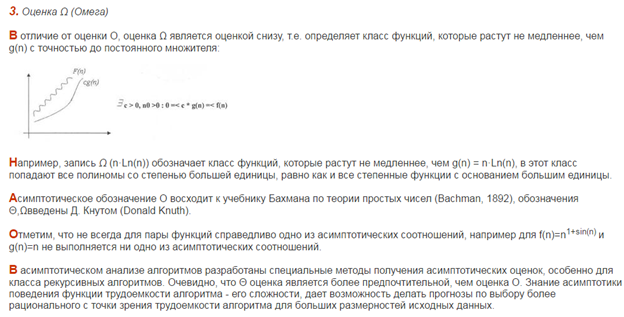

# Алгоритмы. Анализ алгоритмов. Асимптотическое обозначение.

## Алгоритмы

**Алгоритм** - точное предписание, однозначнно определяющее вычислительный процесс, ведущий к исходным данным.
>Говоря неформально, алгоритм — это любая корректно определенная вычислительная процедура, на вход (input) которой подается некоторая величина или набор величин и результатом выполнения которой является выходная (output) величина или набор значений. Таким образом, алгоритм представляет собой последовательность вычислительных шагов, преобразующих входные величины в выходные.  
Алгоритм также можно рассматривать как инструмент, предназначенный для решения корректно поставленной вычислительной задачи (computational problem). В постановке задачи в общих чертах задаются отношения между входом и выходом. В алгоритме описывается конкретная вычислительная процедура, с помощью которой удается добиться выполнения указанных отношений.

## Анализ алгоритмов

>Анализ заключается в том, чтобы предсказать требуемые для его выполнения ресурсы. Иногда оценивается потребность в таких ресурсах, как память, пропускная способность сети или необходимое аппаратное обеспечение, но чаще всего определяется время вычисления. Путем анализа нескольких алгоритмов, предназначенных для решения одной и той же задачи, можно выбрать наиболее эффективный из них. В процессе такого анализа может также оказаться, что несколько алгоритмов примерно равноценны, а многие алгоритмы в процессе анализа часто приходится отбрасывать.  
Прежде чем мы научимся анализировать алгоритмы, необходимо разработать технологию, которая будет для этого использоваться. В эту технологию нужно будет включить модель ресурсов и величины их измерения. С учетом того, что алгоритмы реализуются в виде компьютерных программ, в этой книге в большинстве случаев в качестве технологии реализации принята модель обобщенной однопроцессорной машины с памятью с произвольным доступом (Random-Access Machine — RAM). В этой модели команды процессора выполняются последовательно; одновременно выполняемые операции отсутствуют.  
Строго говоря, в модели RAM следует точно определить набор инструкций и время их выполнения, однако это утомительно и мало способствует пониманию принципов разработки и анализа алгоритмов. С другой стороны, нужно соблюдать осторожность, чтобы не исказить модель RAM. Например, что будет, если в RAM встроена команда сортировки? В этом случае сортировку можно выполнять с помощью всего одной команды процессора. Такая модель нереалистична, поскольку настоящие компьютеры не имеют подобных встроенных команд, а мы ориентируемся именно на их устройство. В рассматриваемую модель входят те команды, которые обычно можно найти в реальных компьютерах: арифметические (сложение, вычитание, умножение, деление, вычисление остатка от деления, приближение действительного числа ближайшим меньшим или ближайшим большим целым), операции перемещения данных (загрузка, занесение в память, копирование) и управляющие (условное и безусловное ветвление, вызов подпрограммы и возврат из нее). Для выполнения каждой такой инструкции требуется определенный фиксированный промежуток времени.  
В модели RAM есть целочисленный тип данных и тип чисел с плавающей точкой (для хранения действительных чисел). Несмотря на то что обычно в этой книге точность не рассматривается, в некоторых приложениях она играет важную роль. Также предполагается, что существует верхний предел размера слова данных. Например, если обрабатываются входные данные с максимальным значением п, обычно предполагается, что целые числа представлены clgn битами для некоторой константы с > 1. Требование с > 1 обусловлено тем, что в каждом слове должно храниться одно из п значений, что позволит индексировать входные элементы. Кроме того, предполагается, что с — это конечная константа, поэтому объем слова не может увеличиваться до бесконечности. (Если бы это было возможно, в одном слове можно было бы хранить данные огромных объемов и осуществлять над ними операции в рамках одной элементарной команды, что нереально.)

## Асимптотическое обозначение

Целью асимптотического анализа является сравнение затрат времени и других ресурсов различными алгоритмами, предназначенными для решения одной и той же задачи, при больших объемах входных данных.  
Асимптотические обозначения позволяют показать скорость роста функции, маскируя при этом конкретные коэффициенты.

 

 