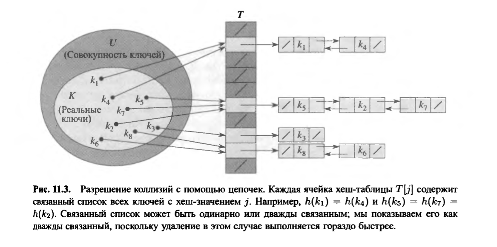

# Хэширование. Хеш-функции. Хеширование с раздельными цепочками.

**Хэширование** - структура данных, в которой можно будет осуществлять, поиск за время O(1).  
Если каждый элемент находится там где ему следует быть, то поиск может использовать только сравнения для обнаружения присутствия искомого.

**Хэш-таблица** это коллекция элементов, которые сохраняются таким образом чтобы позже их было легко найти. Каждая позиция в хэш-таблице (часто называемая слотом) может содержать собственно элемент и целое число, начинающееся с нуля. Например, у нас есть слот 0, слот 1, слот 2 и так далее.  
Первоначально хэш таблица не содержит элементов, так что каждый из слотов пуст.

## Хеш-функции

Связь между элементом и слотом, в который он кладётся, называется **хэш-функцией**. Она принимает любой элемент из коллекции и возвращает целое число из диапазона имен слотов (от О до m-1).  
Для заданной коллекции элементов хэш функция, связывающая каждый из них c уникальным слотом, называется **идеальной хэш-функцией**

### Метод деления

Построение хеш-функции методом деления состоит в отображении ключа **к** в одну из **m** ячеек путем получения остатка от деления **к** на **m**:

**h(k) = к mod m**

>Например, если хеш-таблица имеет размер **m = 12**, а значение ключа **k = 100**, то **h(k) = 4**. Поскольку для вычисления хеш-функции требуется только одна операция деления, хеширование методом деления достаточно быстрое.

>Число **m** не должно быть степенью **2**, поскольку если **m = 2^Р**, то **h(k)** представляет собой просто **р** младших битов числа **k**.  
>Зачастую хорошие результаты можно получить, выбирая в качестве значения **m** простое число, достаточно далекое от степени двойки. Например, мы хотим создать хеш-таблицу с разрешением коллизий методом цепочек для хранения порядка **n = 2000** символьных строк, размер символов в которых равен **8 бит**. Нас устраивает проверка в среднем трех элементов при неудачном поиске, так что мы выбираем размер таблицы равным **m = 701**. Число **701** выбрано как простое число, близкое к величине **2000/3** и не являющееся степенью **2**. Рассматривая каждый ключ к как целое число, мы получаем искомую хеш-функцию  
**h(k) = к mod 701**

### Метод умножения

Построение хеш-функции методом умножения выполняется в два этапа. Сначала мы умножаем ключ к на константу 0 < А < 1 и выделяем дробную часть полученного произведения. Затем мы умножаем полученное значение на m и выделяем целую часть:
h(k) = ⌊m (кА mod 1)⌋

### Универсальное хэширование

Если специально подбирать данные, можно попасть в такую ситуацию, когда все ключи будут соответствовать одной позиции в хеш-таблице, тогда время поиска индекса может достигать времени поиска в списке. Выход из данной ситуации — **универсальное хеширование** — выбор хеш-функции во время исполнения программы случайным образом из некоторого множества хеш-функций. Т.е. при повторном вызове алгоритма с теми же данными алгоритм может работать уже совсем по-другому.

## Хеширование с раздельными цепочками

Два ключа могут быть хешированны в одну и ту же ячейку. Такая ситуация называется **коллизией**.

Технология сцепления элементов состоит в том, что элементы множества, которым соответствует одно и то же хеш-значение, связываются в цепочку-список. В позиции номер i хранится указатель на голову списка тех элементов, у которых хеш-значение ключа равно i; если таких элементов в множестве нет, в позиции j записан NULL.

